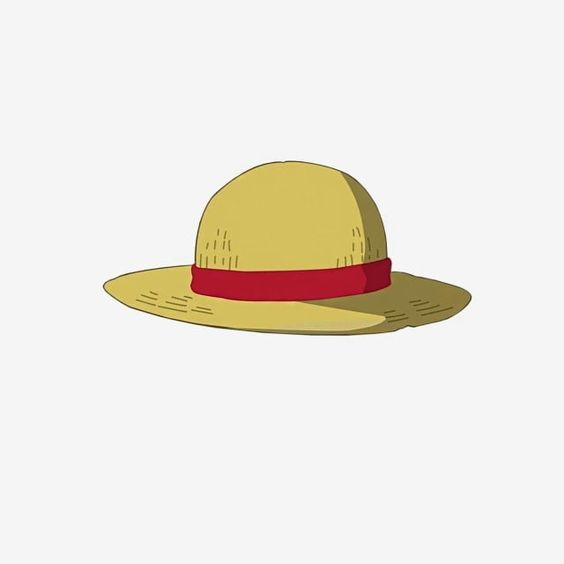

<a name="readme-top">

<br/>

<br />
<div align="center">
  <a href="https://github.com/Joshish01">
  <!-- TODO: If you want to add logo or banner you can add it here -->
    
  </a>
<!-- TODO: Change Title to the name of the title of your Project -->
  <h3 align="center">Final Project</h3>
</div>
<!-- TODO: Make a short description -->
<div align="center">
  Portfolio and a Project Showcase
</div>

<br />

<!-- TODO: Change the zyx-0314 into your github username  -->
<!-- TODO: Change the WD-Template-Project into the same name of your folder -->


---

<br />
<br />

<!-- TODO: If you want to add more layers for your readme -->
<details>
  <summary>Table of Contents</summary>
  <ol>
    <li>
      <a href="#overview">Overview</a>
      <ol>
        <li>
          <a href="#key-components">Key Components</a>
        </li>
        <li>
          <a href="#technology">Technology</a>
        </li>
      </ol>
    </li>
    <li>
      <a href="#rule,-practices-and-principles">Rules, Practices and Principles</a>
    </li>
    <li>
      <a href="#resources">Resources</a>
    </li>
  </ol>
</details>

---

## Overview

<!-- TODO: To be changed -->
<!-- The following are just sample -->
Final Project for Web Design

This project showcases the work completed throughout the term, featuring five main pages:

Home: Introduction of the site.
About: Information about me
Projects: Detailed display of all projects completed during the term.
Credits: Acknowledgements 
Contact: Contact information


### Key Components
<!-- TODO: List of Key Components -->
<!-- The following are just sample -->
- MultiPage Website/Single Page Website
- Parallax transition
- Transactional
- Hover Effects
- Active Effects
- Check Effects
- Reponsive 

### Technology
<!-- TODO: List of Technology Used -->


## Rules, Practices and Principles
1. Always use `WD-` in the front of the Title of the Project for the Subject followed by your custom naming.
2. Do not rename any .html files; always use `index.html` as the filename.
3. Place Files in their respective folders.
4. All file naming are in camel case.
   - Camel case is naming format where there is no white space in separation of each words, the first word is in all lower case while the succeding words first letter are in upper followed by lower cased letters.
   - ex.: buttonAnimatedStyle.css
5. Use only `External CSS`.
6. Renaming of Pages folder names are a must, and relates to what it is doing or data it holding.
7. File Structure to follow below.

```
WD-ProjectName
└─ assets
|   └─ css
|   |   └─ style.css
|   └─ img
|   |   └─ fileWith.jpeg/.jpg/.webp/.png
|   └─ js
|       └─ script.js
└─ pages
|  └─ pageName
|     └─ assets
|     |  └─ css
|     |  |  └─ style.css
|     |  └─ img
|     |  |  └─ fileWith.jpeg/.jpg/.webp/.png
|     |  └─ js
|     |     └─ script.js
|     └─ index.html
└─ index.html
└─ readme.md
```

## Resources

<!-- TODO: Add References -->
| Title | Purpose | Link |
|-|-|-|
| wakatime integration| used it to track my coding activity | https://wakatime.com/projects/WD-Finals?start=2024-07-09&end=2024-07-15
| Code | watched the tutorial for the code | https://www.youtube.com/watch?v=w9kV0uW1dmI&t=1983s |
| Card | watched the tutorial for the code | https://www.youtube.com/watch?v=45mnmy2JUl0&t=10s |
| Icons | used the icons for the project | https://fontawesome.com/
| Fonts | used the fonts for the project | https://fonts.google.com/
| Wireframe img | used the img for the portfolio page | https://ph.pinterest.com/pin/1131740581333379874/
| Resume img | used the img for the portfolio page | https://ph.pinterest.com/pin/61361613667040616/
| Header and Footer img | used the img for the portfolio page | https://ph.pinterest.com/pin/251497960434136203/
| Feature img | used the img for the portfolio page | https://ph.pinterest.com/pin/506936501819335719/
| Pinterest img | used the img for the credits page | https://ph.pinterest.com/pin/497155246340294997/
| Youtube img | used the img for the credits page | https://ph.pinterest.com/pin/2462974790922886/
| Github img | used the img for the credits page | https://ph.pinterest.com/pin/351351208444686783/
| Font awesome img | used to get the img for the credits page | https://www.google.com/search?sca_esv=e0b5cfa75ef3a8a9&rlz=1C1VDKB_enPH1077PH1077&sxsrf=ADLYWII2VTZWoOVARW3Vz2ubLdXN7KFz4g:1721041750391&q=fonts+awesome+logo&udm=2&fbs=AEQNm0AeMNWKf4PpcKMI-eSa16lJoRPMIuyspCxWO6iZW9F1Ns6EVsgc0W_0xN47PHaanAEtg26fpfc9gg2y1-ZsywNNidIzOA0khSyMN51n7r3LlDC9M1NYStuTRDcBUYQ58dKt-Q6SigUS4Yne5yDHLg0vPBr98Nz98twIaNcnWiKaD4QuEh93Q53sB-UkWP9OcfO5KeatY98HR7cDW9ZTjFpZV7kJtA&sa=X&ved=2ahUKEwjEy7OR9KiHAxXRrVYBHefEDnQQtKgLegQIDxAB&biw=1707&bih=772&dpr=1.13#imgrc=JlScBIp8P5MOvM&imgdii=-T86340-Jn1poM
| Google Fonts | used to get the img for the credits page | https://www.google.com/search?q=fonts+google+jpeg&sca_esv=e0b5cfa75ef3a8a9&rlz=1C1VDKB_enPH1077PH1077&udm=2&biw=1707&bih=772&sxsrf=ADLYWIL-yayNX1pDmNT7cmRS0ssVuaMAKg%3A1721041525134&ei=dQKVZvDsB_ba2roPz9uP2A0&ved=0ahUKEwiw-_6l86iHAxV2rVYBHc_tA9sQ4dUDCBA&uact=5&oq=fonts+google+jpeg&gs_lp=Egxnd3Mtd2l6LXNlcnAiEWZvbnRzIGdvb2dsZSBqcGVnSP6CAlCk9gFY7YECcAJ4AJABAJgBUaABkgSqAQE3uAEDyAEA-AEBmAIEoALAAsICBBAjGCfCAgYQABgIGB7CAgUQABiABMICBBAAGB7CAgYQABgFGB6YAwCIBgGSBwE0oAfhEw&sclient=gws-wiz-serp#vhid=y6tziFh54WkAMM&vssid=mosaic

